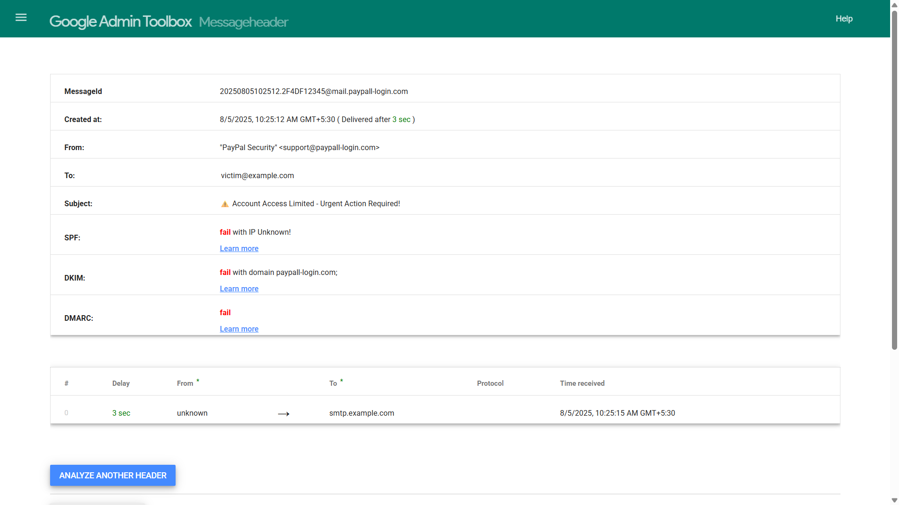

# 🐟 Task 2: Phishing Email Analysis

## 🎯 Objective
Analyze a phishing email sample to identify key indicators of phishing.

---

## 📁 Files Included
- `phishing-sample.txt`: The phishing email content
- `header-analysis.txt`: Email header showing spoofing
- `phishing-report.md`: My analysis and findings

---

## 🛠 Tools Used
- Google Header Analyzer
- Manual inspection

---

## 🖼 Screenshot

---

## ✅ Key Findings
- Spoofed sender address
- Urgent subject line
- Fake links
- Failed SPF/DKIM/DMARC

---

## 📌 Learning Outcome
Learned to identify phishing tactics, verify sender authenticity, and analyze email headers.

---
