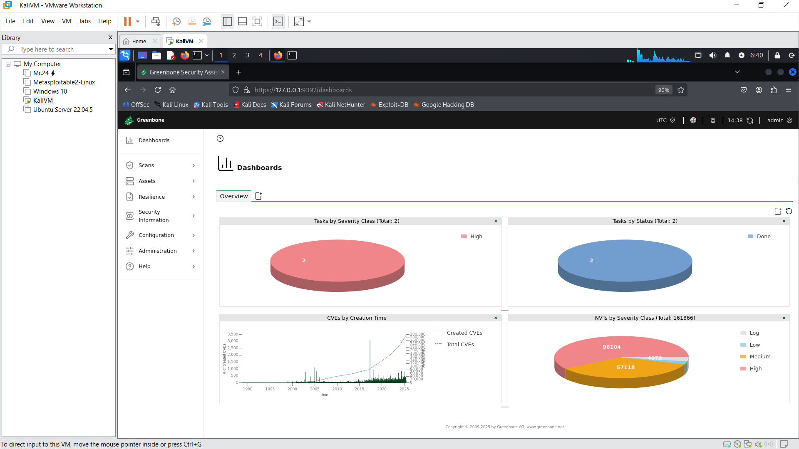
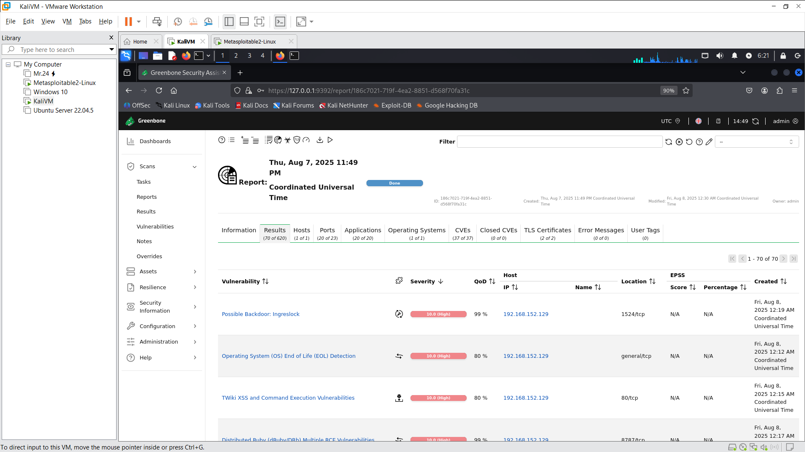

# 🛡 Task 3: Basic Vulnerability Scan (Metasploitable2)

## 🎯 Objective
Use OpenVAS (GVM) to perform a vulnerability scan on a Metasploitable2 machine to identify security weaknesses and understand CVSS scoring.

---

## 🛠 Tools Used
- **Kali Linux**
- **OpenVAS (GVM)** – Greenbone Vulnerability Manager
- **Metasploitable2** – Intentionally vulnerable Linux VM

---

## 📋 Target Details
- **IP Address:** 192.168.152.129 (Metasploitable2)
- **System Type:** Linux Ubuntu 8.04 LTS (vulnerable VM)
- **Purpose:** Ethical hacking training & vulnerability scanning

---

## 🔥 Top Critical Vulnerabilities

### 1. vsftpd 2.3.4 Backdoor Command Execution
- **CVSS Score**: 10.0 (Critical)
- **Port**: 21 (FTP)
- **Fix**: Uninstall vsftpd 2.3.4 and use an updated, trusted FTP server.

### 2. Samba smbd 3.x - Remote Code Execution
- **CVSS Score**: 10.0 (Critical)
- **Port**: 445 (SMB)
- **Fix**: Upgrade Samba to ≥ 4.x and disable SMBv1 if not needed.

### 3. MySQL Privilege Bypass
- **CVSS Score**: 10.0 (Critical)
- **Port**: 3306 (MySQL)
- **Fix**: Harden MySQL, update version, disable remote root login.

### 4. Unencrypted HTTP Services
- **CVSS Score**: 7.5 (High)
- **Port**: 80 (HTTP)
- **Fix**: Enable HTTPS and redirect HTTP traffic to HTTPS.

### 5. OpenSSH with Weak Ciphers
- **CVSS Score**: 7.5 (High)
- **Port**: 22 (SSH)
- **Fix**: Disable weak ciphers in sshd_config and use strong algorithms.

---

## 📸 Screenshots
- 
- 

---

## 📌 Learning Outcome
- Learned how to configure OpenVAS in Kali Linux.
- Understood CVSS scoring for vulnerabilities.
- Identified and documented critical risks in a vulnerable machine.

---